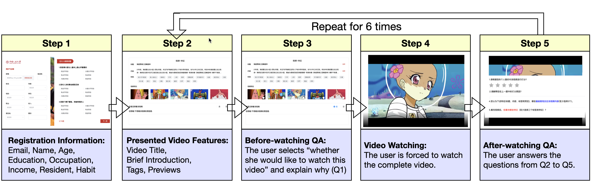
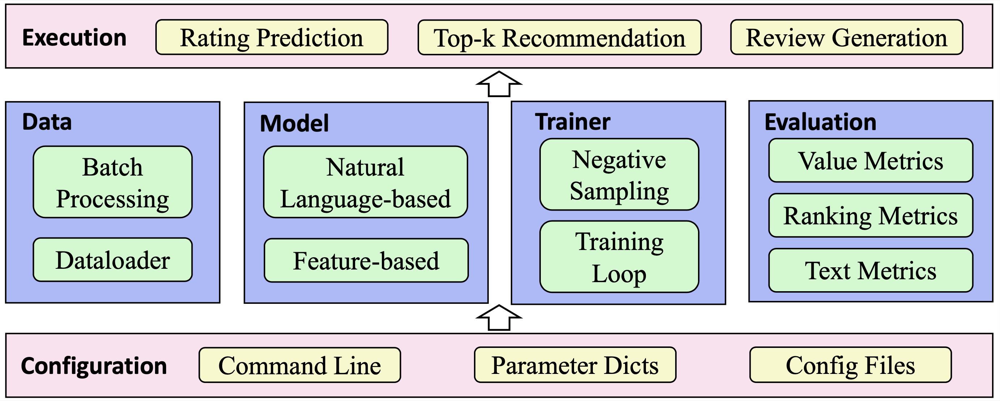

# REASONER: An Explainable Recommendation Dataset with Multi-aspect Real User Labeled Ground Truths

[Homepage] | [Dataset] | [Library] | [Paper]

[HomePage]: https://reasoner2023.github.io/
[Dataset]: https://reasoner2023.github.io/docs/dataset
[Library]: https://reasoner2023.github.io/docs/library
[Paper]: https://arxiv.org/abs/2303.00168v1

**REASONER** is an explainable recommendation dataset with multi-aspect real user labeled ground truths. The complete labeling process for each user is shown in following figure.

In specific, we firstly develop a video recommendation platform, where a series of questions around the recommendation explainability are carefully designed. Then, we recruit about 3000 users with different backgrounds to use the system, and collect their behaviors and feedback to our questions.

The dataset contains the following files.

```plain
 REASONER-Dataset
  │── dataset
  │   ├── interaction.csv
  │   ├── user.csv
  │   ├── video.csv
  │   ├── bigfive.csv 
  │   ├── tag_map.csv 
  │   ├── video_map.csv 
  │── preview
  │── README.md
```

## How to Obtain our Dataset

You can directly download the REASONER dataset through the following three links:

- [](https://drive.google.com/drive/folders/1dARhorIUu-ajc5ZsWiG_XY36slRX_wgL?usp=share_link)

- [](https://pan.baidu.com/s/1L9AzPe0MkRbMwk6yeDj4QA?pwd=ipxd)

- [](https://1drv.ms/f/s!AiuzqR3lP02KbCZOY3c8bfb3ZWg?e=jWTuc1)

## Data description

### 1. interaction.csv

This file contains the user's annotation records on the video, including the following fields:

| Field Name:         | Description                                                  | Type    | Example                                                      |
| :------------------ | :----------------------------------------------------------- | :------ | :----------------------------------------------------------- |
| user_id             | ID of the user                                               | int64   | 0                                                            |
| video_id            | ID of the viewed video                                       | int64   | 3650                                                         |
| like                | Whether user like the video: 0 means no, 1 means yes         | int64   | 0                                                            |
| persuasiveness_tag  | The user selected tags for the question "Which tags are the reasons that you would like to watch this video?" before watching the video | list    | [4728,2216,2523]                                             |
| rating              | User rating for the video, the range is 1.0~5.0              | float64 | 3.0                                                          |
| review              | User review for the video                                    | str     | This animation is very interesting, my friends and I like it very much. |
| informativeness_tag | The user selected tags for the question "Which features are most informative for this video?" after watching the video | list    | [2738,1216,2223]                                             |
| satisfaction_tag    | The user selected tags for the question "Which features are you most satisfied with?" after watching the video. | list    | [738,3226,1323]                                              |
| watch_again         | If the system only show the satisfaction_tag to the user, whether the she would like to watch this video? 0 means no, 1 means yes | int64   | 0                                                            |

Note that if the user chooses to like the video, the `watch_again` item has no meaning and is set to 0.

### 2. user.csv

This file contains user profiles.

| Field Name: | Description                               | Type  | Example             |
| :---------- | :---------------------------------------- | :---- | :------------------ |
| user_id     | ID of the user                            | int64 | 1005                |
| age         | User age (indicated by ID)                | int64 | 3                   |
| gender      | User gender: 0 means female, 1 means male | int64 | 0                   |
| education   | User education level (indicated by ID)    | int64 | 3                   |
| career      | User occupation (indicated by ID)         | int64 | 20                  |
| income      | User income (indicated by ID)             | int64 | 3                   |
| address     | User address (indicated by ID)            | int64 | 23                  |
| hobby       | User hobbies                              | str   | drawing and soccer. |

### 3. video.csv

This file contains information of videos.

| Field Name: | Description                             | Type  | Example                                   |
| :---------- | :-------------------------------------- | :---- | :---------------------------------------- |
| video_id    | ID of the video                         | int64 | 1                                         |
| title       | Title of the video                      | str   | Take it once a day to prevent depression. |
| info        | Introduction of the video               | str   | Just like it, once a day                  |
| tags        | ID of the video tags                    | list  | [112,33,1233]                             |
| duration    | Duration of the video in seconds        | int64 | 120                                       |
| category    | Category of the video (indicated by ID) | int64 | 3                                         |

### 4. bigfive.csv

We administered the Big Five Personality Test based on CBF-PI-15 to the annotators, and their responses to 15 questions, along with a `user_id` column, are stored in the `bigfive.csv` file. The CBF-PI-15 scale utilizes a Likert six-point scoring system with the following score interpretations:

- 0: Completely Not Applicable
- 1: Mostly Not Applicable
- 2: Somewhat Not Applicable
- 3: Somewhat Applicable
- 4: Mostly Applicable
- 5: Completely Applicable

In this scale, questions 2 and 5 are reverse-scored. The dimensions and corresponding items are as follows:

- Neuroticism Dimension (Items 7, 11, and 12)
- Conscientiousness Dimension (Items 6, 8, and 15)
- Agreeableness Dimension (Items 1, 9, and 13)
- Openness Dimension (Items 3, 4, and 10)
- Extraversion Dimension (Items 2, 5, and 14)

The questions are described as follows:

| Question | Description                                                  |
| :------- | :----------------------------------------------------------- |
| Q1       | I think most people are basically well-intentioned           |
| Q2       | I get bored with crowded parties                             |
| Q3       | I'm a person who takes risks and breaks the rules            |
| Q4       | i like adventure                                             |
| Q5       | I try to avoid crowded parties and noisy environments        |
| Q6       | I like to plan things out at the beginning                   |
| Q7       | I worry about things that don't matter                       |
| Q8       | I work or study hard                                         |
| Q9       | Although there are some liars in the society, I think most people are still credible |
| Q10      | I have a spirit of adventure that no one else has            |
| Q11      | I often feel uneasy                                          |
| Q12      | I'm always worried that something bad is going to happen     |
| Q13      | Although there are some dark things in human society (such as war, crime, fraud), I still believe that human nature is generally good |
| Q14      | I enjoy going to social and entertainment gatherings         |
| Q15      | It is one of my characteristics to pay attention to logic and order in doing things |

We refer the users to [1] and [2] for more details about the Big Five Personality Test.

[1] <https://www.xinlixue.cn/web/xinliliangbiao/rengeliangbiao/2020-04-01/849.html>
[2] Zhang, X., Wang, M-C, Luo, J., He, L. The development and psychometrics evaluation of a very shorten version of the Chinese Big five personality inventory. PLoS ONE.

### 5. tag_map.csv

Mapping relationship between the tag ID and the tag content. We add 7 additional tags that all videos contain, namely "preview 1, preview 2, preview 3, preview 4, preview 5, title, content".

| Field Name:         | Description                                                  | Type    | Example                                                      |
| :------------------ | :----------------------------------------------------------- | :------ | :----------------------------------------------------------- |
| tag_id              | ID of the tag                                                | int64   | 1409                                                         |
| tag_content         | The content corresponding to the tag                         | str     | cute baby                                                    |

### 6. video_map.csv

Mapping relationship between the video ID and the folder name in `preview`.

| Field Name:         | Description                                                  | Type    | Example                                                      |
| :------------------ | :----------------------------------------------------------- | :------ | :----------------------------------------------------------- |
| video_id            | ID of the video                                              | int64   | 1                                                            |
| folder_name         | The folder name corresponding to the video                   | str     | 83062078                                                     |

### 7. preview

Each video contains 5 image previews.

The mapping relationship between the folder name and the video ID is in `video_map.csv`.

## Library

We developed a unified framework, which includes ten well-known explainable recommender models for rating prediction, tag prediction and review generation.


The structure of our library is shown in the figure above. The configuration module is the base part of the library and responsible for initializing all the parameters. We support three methods to specify the parameters, that is, the command line, parameter dictionary and configuration file. Based on the configuration module, there are four upper-layer modules:

- **Data module**. This module aims to convert the raw data into the model inputs. There are two components: the first one is responsible for loading the data and building vocabularies for the user reviews. The second part aims to process the data into the formats required by the model inputs, and generate the sample batches for model optimization.
- **Model module**. This module aims to implement the explainable recommender models. There are two types of methods in our library. The first one includes the feature-based explainable recommender models, and the second one contains the models with natural language explanations. We delay the detailed introduction of these models in the next section.
- **Trainer module**. This module is leveraged to implement the training losses, such as the Bayesian Personalized Ranking (BPR) and Binary Cross Entropy (BCE). In addition, this module can also record the complete model training process.
- **Evaluation module**. This module is designed to evaluate different models, and there are three types of evaluation tasks, that is, rating prediction, top-k recommendation and review generation.

Upon the above four modules, there is an execution module to run different recommendation tasks.

### Requirements

```
python>=3.7.0
pytorch>=1.7.0
```

### Implemented Models

We implement several well-known explainable recommender models and list them according to category:

**Feature based models**:

- **[EFM](model/tag_aware_recommender/efm.py)** from Yongfeng Zhang *et al.*: [Explicit Factor Models for Explainable Recommendation based on Phrase-level Sentiment Analysis](https://www.cs.cmu.edu/~glai1/papers/yongfeng-guokun-sigir14.pdf) (SIGIR 2014).

- **[TriRank](model/tag_aware_recommender/trirank.py)** from Xiangnan He *et al.*: [TriRank: Review-aware Explainable Recommendation by Modeling Aspects](https://wing.comp.nus.edu.sg/wp-content/uploads/Publications/PDF/TriRank-%20Review-aware%20Explainable%20Recommendation%20by%20Modeling%20Aspects.pdf) (CIKM 2015).

- **[LRPPM](model/tag_aware_recommender/lrppm.py)** from Xu Chen *et al.*: [Learning to Rank Features for Recommendation over Multiple Categories](http://yongfeng.me/attach/sigir16-chen.pdf) (SIGIR 2016).

- **[SULM](model/tag_aware_recommender/sulm.py)** from Konstantin Bauman *et al.*: [Aspect Based Recommendations: Recommending Items with the Most Valuable Aspects Based on User Reviews.](https://www.researchgate.net/profile/Konstantin-Bauman/publication/318915371_Aspect_Based_Recommendations_Recommending_Items_with_the_Most_Valuable_Aspects_Based_on_User_Reviews/links/5f06007e92851c52d620bc9f/Aspect-Based-Recommendations-Recommending-Items-with-the-Most-Valuable-Aspects-Based-on-User-Reviews.pdf) (KDD 2017).

- **[MTER](model/tag_aware_recommender/mter.py)** from Nan Wang *et al.*: [Explainable Recommendation via Multi-Task Learning in Opinionated Text Data](https://dl.acm.org/doi/pdf/10.1145/3209978.3210010) (SIGIR 2018).

- **[AMF](model/tag_aware_recommender/amf.py)** from Yunfeng Hou *et al.*: [Explainable recommendation with fusion of aspect information](https://yneversky.github.io/Papers/Hou2019_Article_ExplainableRecommendationWithF.pdf) (WWW 2019).

- In addition to the above shallow models based on matrix factorization, we also implement the following deep feature-based explainable recommender models (called DERM for short).

**Natural Language based models**:

- **[Att2Seq](model/review_aware_recommender/att2seq.py)** from Li Dong *et al.*: [Learning to Generate Product Reviews from Attributes](https://aclanthology.org/E17-1059.pdf) (ACL 2017).

- **[NRT](model/review_aware_recommender/nrt.py)** from Piji Li *et al.*: [Neural Rating Regression with Abstractive Tips Generation for Recommendation](https://arxiv.org/pdf/1708.00154.pdf) (SIGIR 2017).

- **[PETER](model/review_aware_recommender/peter.py)** from Lei Li *et al.*: [Personalized Transformer for Explainable Recommendation](https://arxiv.org/pdf/2105.11601.pdf) (ACL 2021).

### Quick start

Here is a quick-start example for our library. You can directly execute *tag_predict.py* or *review_generate.py* to run a feature based or natural language based model, respectively. In each of these commends, you need to specify three parameters to indicate the names of the model, dataset and configuration file, respectively.

We randomly split the interaction records of each user into training, validation, and test sets according to the ratio of 8:1:1. And the divided datasets can be obtained through [Google Drive](https://drive.google.com/file/d/10z_jRG8OVjd1QDszGiaPyjD4jIy_Fb6m/view?usp=sharing).

Run feature based models:

```bash
python tag_predict.py --model=[model name] --dataset=[dataset] --config=[config_files]
```

Run natural language based models:

```bash
python review_generate.py --model=[model name] --dataset=[dataset] --config=[config_files]
```

### Codes for accessing our data

We provide code to read the data into data frame with *pandas*.

```python
import pandas as pd

# access interaction.csv
interaction_df = pd.read_csv('interaction.csv', sep='\t', header=0)
# get the first ten lines
print(interaction_df.head(10))
# get each column 
# ['user_id', 'video_id', 'like', 'persuasiveness_tag', 'rating', 'review', 'informativeness_tag', 'satisfaction_tag', 'watch_again', ]
for col in interaction_df.columns:
      print(interaction_df[col][:10])

# access user.csv
user_df = pd.read_csv('user.csv', sep='\t', header=0)
print(user_df.head(10))
# ['user_id', 'age', 'gender', 'education', 'career', 'income', 'address', 'hobby']
for col in user_df.columns:
      print(user_df[col][:10])
  
# access video.csv
video_df = pd.read_csv('video.csv', sep='\t', header=0)
print(video_df.head(10))
# ['video_id', 'title', 'info', 'tags', 'duration', 'category']
for col in video_df.columns:
      print(video_df[col][:10])

# access bigfive.csv
bigfive_df = pd.read_csv('bigfive.csv', sep='\t', header=0)
print(bigfive_df.head(10))
# ['user_id', 'Q1', ..., 'Q15']
for col in bigfive_df.columns:
      print(bigfive_df[col][:10])

# access tag_map.csv
tag_map_df = pd.read_csv('tag_map.csv', sep='\t', header=0)
print(tag_map_df.head(10))
# ['tag_id', 'tag_content']
for col in tag_map_df.columns:
      print(tag_map_df[col][:10])
  
# access video_map.csv
video_map_df = pd.read_csv('video_map.csv', sep='\t', header=0)
print(video_map_df.head(10))
# ['video_id', 'folder_name']
for col in video_map_df.columns:
      print(video_map_df[col][:10])
```

## License

Our licensing for the dataset is under a CC BY-NC 4.0 (Creative Commons Attribution-NonCommercial 4.0), with the additional terms included herein. See official instructions [here](https://creativecommons.org/licenses/by-nc/4.0/).

## Cite

Please cite the following paper as the reference if you use our code or dataset.[](https://arxiv.org/abs/2303.00168) [](https://arxiv.org/pdf/2303.00168.pdf)

```
@misc{chen2023reasoner,
      title={REASONER: An Explainable Recommendation Dataset with Multi-aspect Real User Labeled Ground Truths Towards more Measurable Explainable Recommendation}, 
      author={Xu Chen and Jingsen Zhang and Lei Wang and Quanyu Dai and Zhenhua Dong and Ruiming Tang and Rui Zhang and Li Chen and Ji-Rong Wen},
      year={2023},
      eprint={2303.00168},
      archivePrefix={arXiv},
      primaryClass={cs.IR}
}
```
