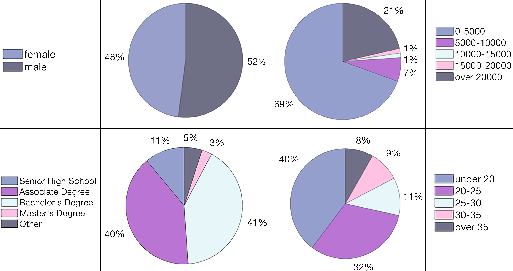
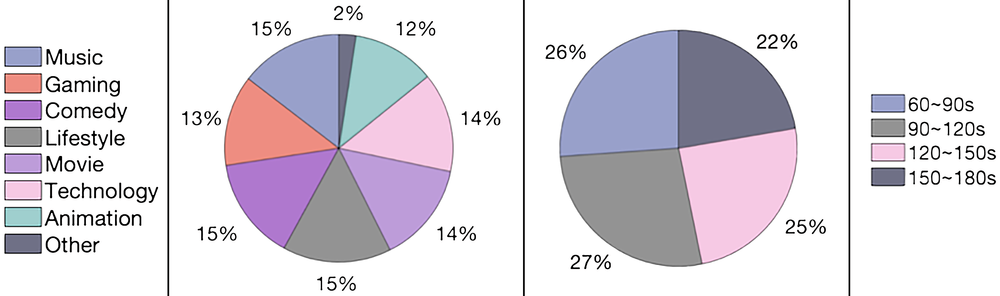
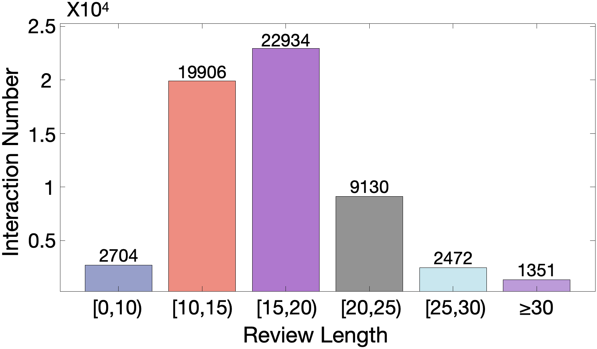

## Introduction

Explainable recommendation has attracted much attention from the academic and industry communities. It has shown great potential for improving the recommendation persuasiveness, informativeness and user satisfaction. While, in the past few years, a lot of promising explainable recommender models have been proposed, the evaluation strategies of these models suffer from several limitations, for example, the explanation ground truths are not labeled by the real users, the explanations are mostly evaluated based on only one aspect, the evaluation strategies can be hard to unify and among others. To alleviate the above problems, we propose to build an explainable recommendation dataset with multi-aspect real user labeled ground truths. In specific, we firstly develop a video recommendation platform, where a series of questions around the explanations are carefully designed. Then, we recruit about 3000 users with different backgrounds to use the system, and collect their behaviors and feedback to our questions. The complete labeling process for each user is shown in following figure. 

## How to Obtain the Dataset

Please provide us with your basic information including your name, institution, and purpose of use to request the dataset. You can email us at reasonerdataset@gmail.com.

## Data description

*REASONER* contains fifty thousand of user-item interactions as well as the side information including the video categories and user profile. Three files are included in the download data:

```plain
 REASONER
  ├── data
  │   ├── interaction.csv
  │   ├── user.csv
  │   ├── video.csv
```

### 1. Descriptions of the fields in `interaction.csv`

| Field Name: | Description | Type | Example |
| :-- | :-- | :-- | :-- |
| user_id | The ID of the user. | int64 | 0 |
| video_id | The ID of the viewed video. | int64 | 3650 |
| like | Whether user like the video. 0 means no, 1 means yes | int64 | 0 |
| reason_tag | Tags representing why the user likes/dislikes the video. | list | [4728,2216,2523] |
| rating | User rating for the video. | float64 | 3.0 |
| review | User review for the video. | str | This animation is very interesting, my friends and I like it very much. |
| video_tag | Tags that reflect the content of the video.<br/> | list | [2738,1216,2223] |
| interest_tag | Tags that reflect user interests. | list | [738,3226,1323] |
| watch_again | Show only the interest tags, will the video be viewed. 0 means no, 1 means yes | int64 | 0 |

Note that if the user chooses to like the video, the `watch_again` item has no meaning and is set to 0.

### 2. Descriptions of the fields in `user.csv`

| Field Name: | Description | Type | Example |
| :-- | :-- | :-- | :-- |
| user_id | The ID of the user. | int64 | 1005 |
| age | User age.The mapping between id and content is shown below. | int64 | 3 |
| gender | User gender. 0 means female, 1 menas male. | int64 | 0 |
| education | User education level. The mapping between id and content is shown below. | int64 | 3 |
| career | User occupation. The mapping between id and content is shown below. | int64 | 20 |
| income | User income. The mapping between id and content is shown below.<br/> | int64 | 3 |
| address | User income. The mapping between id and content is shown below. | int64 | 23 |
| hobby | User hobby. | str | drawing and soccer. |

The mappings between id and content are as below:

```plain
age={
0: "Under 15",
1: "15-20",
2: "20-25",
3: "25-30",
4: "30-35",
5: "35-40",
6: "40-45",
7: "45-50",
8: "Over 50"
},
education={
0: "Elementary School",
1: "Junior Middle School",
2: "Senior High School",
3: "Associate Degree",
4: "Bachelor's Degree",
5: "Master's Degree",
6: "Doctorate",
7: "Other"
},
career={
0: "Technology",
1: "Product",
2: "Design",
3: "Operations",
4: "Marketing",
5: "Human Resources/Finance/Administration",
6: "Senior Management",
7: "Sales",
8: "Media",
9: "Finance",
10: "Education and Training",
11: "Healthcare",
12: "Procurement/Trade",
13: "Supply Chain/Logistics",
14: "Real Estate/Construction",
15: "Agriculture/Forestry/Animal Husbandry/Fishing",
16: "Consulting/Translation/Law",
17: "Tourism",
18: "Service Industry",
19: "Manufacturing",
20: "Other"
},
income={
0: "0-5000",
1: "5000-10000",
2: "10000-15000",
3: "15000-20000",
4: "20000 and above"
}

```

### 3. Descriptions of the fields in `video.csv.`

| Field Name: | Description | Type | Example |
| :-- | :-- | :-- | :-- |
| video_id | The ID of the video. | int64 | 1000 |
| title | The title of the video. | str | 18 |
| info | The introduction of the video. | str | 0 |
| tags | The ID of the video tags. | list | [112,33,1233] |
| duration | The duration of the video in seconds. | int64 | 120 |
| category | The category of the video. The mapping between id and content is shown below.<br/> | int64 | 3 |

The mapping between categories and id is as follows:

```plain
category={
0: 'Music',
1: 'Gaming',
2: 'Comedy',
3: 'Lifestyle',
4: 'Movie & Montage',
5: 'Science & Technology',
6: 'Animation',
7: 'Other'
}
```

## Statistics

### 1. The basic statistics of _REASONER._

|  | #Users | #Items | #Tag | #Interaction | #Tag-Interaction | Sparsity |
| :-- | :-- | :-- | :-- | :-- | :-- | :-- |
| _REASONER_ | 2,997 | 4,672 | 6,115 | 58,497 | 68,359 | 99.6% |

### 2. Statistics on the users



### 3. Statistics on the videos



### 4. Distribution of user-video and video-user interactions


### 4. Distribution of the user-tag interactions


### 4. Distribution of the video-tag interactions


### 5. The averaged Jaccard similarity for different explanation aspects

| Explanation aspects | Q1-Q2 | Q1-Q3 | Q2-Q3 |
| ------------------- | ----- | ----- | ----- |
| Jaccard similarity  | 0.423 | 0.364 | 0.410 |

### 7. The ratios between the numbers of users who select multi-modal explanations and the other ones

| multi/single | Reason tag | Video tag | Interest tag |
| :----------: | :--------: | :-------: | :----------: |
|     User     |   0.635    |   0.638   |    0.559     |

### 7. Statistics on the user reviews


