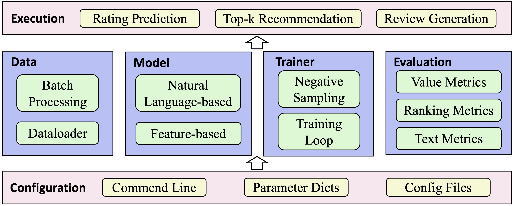

## Introduction

A unified framework, which includes ten well-known explainable recommender models for rating prediction, tag prediction and review generation.

## Model

### Tag-aware models

- EFM
  - Explicit Factor Models for Explainable Recommendation based on Phrase-level Sentiment Analysis  (Yongfeng Zhang et al.,  SIGIR2014)
  - Explicit Factor Model predicts the user preferences and generates explainable recommendations based on explicit product features and user opinions from the review information.
- TriRank
  - TriRank: Review-aware Explainable Recommendation by Modeling Aspects  (Xiangnan He et al.,  CIKM2015)
  - TriRank models the user-item-aspect ternary relation as a heterogeneous tripartite graph based on user ratings and reviews, and it devises a vertex ranking algorithm for recommendation.
- LRPPM
  - Learning to Rank Features for Recommendation over Multiple Categories (Xu Chen et al., SIGIR 2016)
  - A tensor-matrix factorization algorithm which captures the user preferences using ranking-based optimization objective over various item aspects.
- SULM
  - Aspect Based Recommendations: Recommending Items with the Most Valuable Aspects Based on User Reviews.  (Konstantin Bauman etal., KDD 2017)
  - SULM enhances recommendations by recommending not only item but also the specific aspects by using aspect-level sentiment analysis.
- MTER
  - Explainable Recommendation via Multi-Task Learning in Opinionated Text Data  (Nan Wang et al.,  SIGIR2018)
  - MTER is a tensor factorization method which models the task of item recommendation using a three-way tensor over the users, items and features. We omit the modeling of the opinions in the original implementation for adapting our data.
- AMF
  - Explainable recommendation with fusion of aspect information (Yunfeng Hou et al., WWW2019)
  - AMF improves the recommendation accuracy by using the auxiliary information extracted from the user review aspects.
- DERM-MLP
  - DERM is a deep recommender model for jointly predicting the ratings and tags. The two tasks share the set of user/item/tag embeddings. The hidden states as well as the tag embeddings are put into different layers corresponding to the different tasks.
- DERM-MF
  - DERM-MF firstly obtains a hidden state based on the user/item embeddings using matrix factorization, and then the outputs are computed by a neural network.
- DERM-C
  - DERM-C combines matrix factorization and Multi-Layer Perceptron (MLP) to derive the hidden states, and the outputs are merged in a concatenated manner.
- DERM-H
  - DERM-H leverages the tags to profile the users and items, and then use the same architecture as DERM-MLP for predicting the ratings and tags.

### Review-aware models

- Att2Seq
  - Learning to Generate Product Reviews from Attributes  (Li Dong et al. ACL2017)
  - A review generation model which uses LSTM as the decoder, and output the texts directly based on the user/item IDs and rating information.
- NRT
  - Neural Rating Regression with Abstractive Tips Generation for Recommenda,tion (Piji Li et al, SIGIR2017)
  - NRT simultaneously predicts the reviews and ratings based on the input user-item pair, where the two tasks share the same embedding and hidden layers.
- PETER
  - Personalized Transformer for Explainable Recommendation  (Lei Li et al. ACL2021)
  - PETER leverages Transformer to generate the user reviews, which is a state-of-the-art review generation model.

## Framework

 The structure of our library is shown in the figure above. The configuration module is the base part of the library and responsible for initializing all the parameters. We support three methods to specify the parameters, that is, the commend line, parameter dictionary and configuration file. Based on the configuration module, there are four upper-layer modules:

- Data module. This module aims to convert the raw data into the model inputs. There are two components: the first one is responsible for loading the data and building vocabularies for the user reviews. The second part aims to process the data into the formats required by the model inputs, and generate the sample batches for model optimization.
- Model module. This module aims to implement the explainable recommender models. There are two types of methods in our library. The first one includes the feature-based explainable recommender models, and the second one contains the models with natural language explanations. We delay the detailed introduction of these models in the next section.
- Trainer module. This module is leveraged to implement the training losses, such as the Bayesian Personalized Ranking (BPR) and Binary Cross Entropy (BCE). In addition, this module can also record the complete model training process.
- Evaluation module. This module is designed to evaluate different models, and there are three types of evaluation tasks, that is, rating prediction, top-k recommendation and review generation. Upon the above four modules, there is an execution module to run different recommendation tasks.

## 4、Quick start

Here is a quick-start example for our library. You can directly execute _tag_prediction.py_ or _review_generate.py_ to run a feature-based or review-based model, respectively. In each of these commends, you need to specify three parameters to indicate the names of the model, dataset and configuration file, respectively.

```plain
python tag_prediction.py --model=[model] --datatset=[dataset] --config=[config_files]
python review_prediction.py --model=[model] --datatset=[dataset] --config=[config_files]
```
